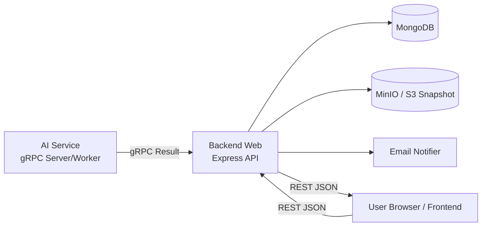

# Architecture Overview

## Context
This repository is in transition from a single Python backend prototype to a production-ready multi-service system. The target follows `docs/SOW_AI_CCTV_Simple.docx`: web app stack with separate backend responsibilities and AI integration via API.

## Current State (Prototype)
- Active delivery scope:
  - `backend-web/`: primary backend implementation target (REST to frontend, gRPC integration with AI).
  - `frontend/`: new frontend workspace (currently empty).
  - `ai/`: AI service/model code reference for integration contract alignment.
- Legacy/reference only:
  - `backend/`, `backend-ai/`, `frontend-old/`.

## Target State (Production)
- `frontend/` (React + Tailwind): web UI only, no AI/business logic.
- `backend-web/` (Node.js + Express): source of truth for auth, RBAC, master data, camera/model mapping, jobs, reporting, notifications, and orchestration.
- `ai/` (AI service): dedicated inference service exposed via gRPC for internal calls.
- Database: MongoDB.
- Queue/Worker: Redis + BullMQ (or equivalent) for scheduled snapshot/inference jobs and retry.
- Object storage: MinIO (on-prem) or S3-compatible storage.

## Communication Protocols
- Frontend -> Backend Web: REST/HTTP JSON.
- Backend Web <-> AI Service: gRPC (protobuf contract, internal network only).

## Service Boundaries
- Frontend calls `backend-web` only.
- `backend-web` translates REST payloads into gRPC requests and receives gRPC inference results from AI service.
- `ai` service must stay stateless except model cache; business decisions and notification rules stay in `backend-web`.
- AI model training/fine-tuning is out of scope for this repo workflow.

## Runtime Flow
1. AI service processes camera frames and produces inference output.
2. AI sends inference result to `backend-web` over gRPC (unary or stream).
3. `backend-web` normalizes payload and stores it in MongoDB/object storage.
4. `backend-web` applies policy logic (threshold, cooldown, notification rules).
5. `backend-web` publishes data to frontend-facing REST endpoints.
6. Frontend reads live/report/status data from `backend-web`.

## Flowchart

## gRPC Contract Notes
- Keep protobuf files versioned (example: `proto/ai/v1/inference.proto`).
- Recommended RPC:
  - `rpc PushInference(InferResult) returns (Ack);`
  - `rpc StreamInference(stream InferResult) returns (Ack);`
  - `rpc Health(HealthRequest) returns (HealthResponse);`
- Breaking changes must create new package/service version (`ai.v2`), not mutate `ai.v1`.

## Migration Plan
1. Freeze new feature work in `backend/` except bug fixes.
2. Define stable protobuf contracts between `backend-web` and `ai` (versioned).
3. Move authentication/RBAC/master-data into `backend-web` first.
4. Move scheduler + notification pipeline to queue workers.
5. Keep `ai` focused on gRPC inference and model capability expansion.
6. Deprecate `backend/` after parity checklist is complete.

## Engineering Rules During Transition
- No direct frontend-to-AI calls.
- No production code in AI service may import from research notebooks/data paths.
- Breaking REST changes require endpoint version bump (`/api/v2/...`).
- Breaking gRPC changes require protobuf package bump (`ai.v2`).
- Keep environment config in `.env` files; never commit credentials.
